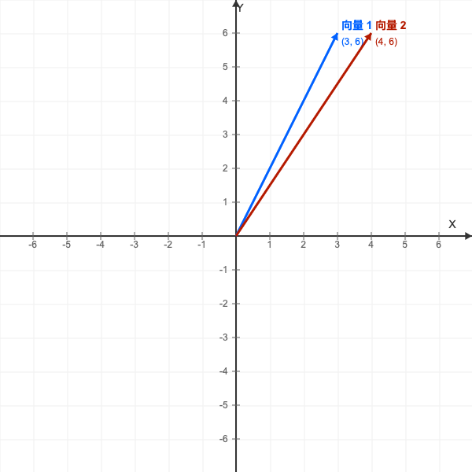
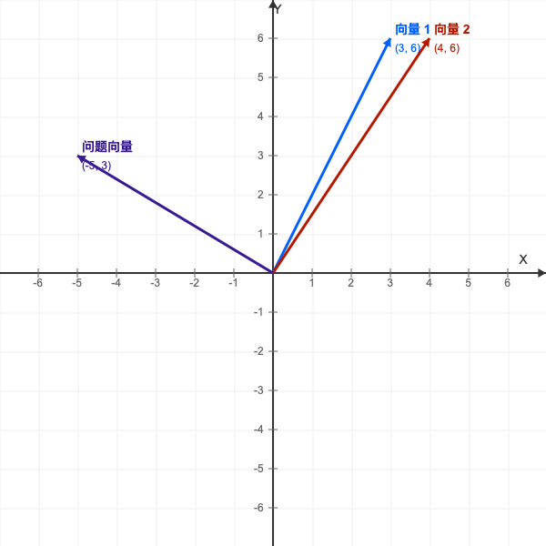
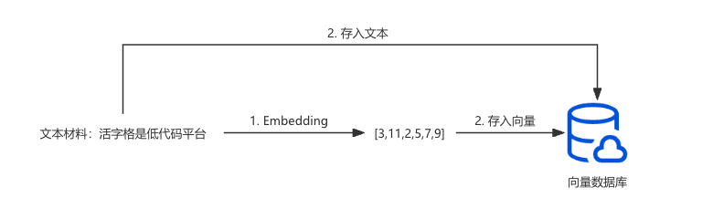
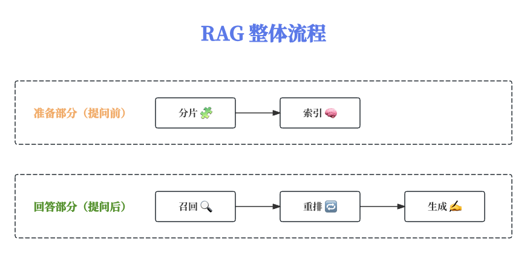

# 基础原理

对于一个企业专属的智能客服，AI 大模型是必不可少，例如 deepseek、chatGPT 等。
可模型本身并不知道公司的各种产品信息，所以需要我们在给模型发送问题的时候，将产品手册一同发送给模型。
可如果产品手册的内容比较多，例如有上百页，上千页，会为该场景带来很多问题：

- **模型可能无法读取所有内容：** 大语言模型只能存储一定量的信息，通常成这个量为上下文窗口大小。如果产品手册内容超过上下文窗口大小，模型就会读了后面内容，忘记前面内容。前面所回答的准确率也无法得到保障。

- **模型推理成本较高：** 模型推理成本取决于输入与输出的 token 数量。一般来说，输入的 token 数量越多，推理成本就越高。

- **模型推理慢：** 输入的内容越多，模型需要消化的内容也就越多，上百页的手册丢给模型，会极大的拖慢模型推理的速度。

既然直接将手册扔给模型不可行，那么我们可以考虑将和问题相关的内容提取出来扔给模型。这时，RAG 技术就派上用场了。

## RAG 的基本运行流程

RAG 会将文档的内容切割为多个片段。当用户提出问题后， RAG 会根据问题的内容，在所有的片段中寻找相关内容。
假设用户问题仅关联了 2 个片段，那么 RAG 仅会将这 2 个片段发送给模型，这样整个手册扔给模型的问题便迎刃而解了。

上述仅是 RAG 流程的简化链路。每个环节都包含了很多实现细节。
一般来说，RAG 的基本流程包含两个部分：

- 准备阶段（用户提问前）：需要将相关的文档都准备好，并完成相应的预处理。其包含**分片**与**索引**两个环节。

- 回答阶段（用户提问后）：需要根据用户的问题，依次触发回答问题的各个环节，包括**召回**、**重拍**与**生成**。

接下来我们逐步拆解，看看这五个环节都是如何工作的。

### 分片

顾名思义，分片就是将文档分成多个片段。

分片的方式有很多种。可以按照字数来分，比如 1000 字为一个片段。也可以按照段落来分，每个段落是一个片段。
亦或者可以按照章节分，按照页码分，按照指定的字符分等等。无论选择何种方式，最终目标是将一篇完整的文档切分为多份。至此，该环节即可结束。

### 索引

索引是通过 **Embedding** 将片段文本转化为**向量**，然后将片段文本和对应的向量存储在**向量数据库**中的过程。

这里存在几个重要概念需要理解：

- **向量**：数学上的一个概念，既包含了大小，也包含了方向。通常我们会用一个数组来表示它。RAG 中使用的向量，其维度可以包含数百个甚至上千个。维度越大，向量所包含的信息也就越丰富，使用这些向量做的工作内容可靠性也有越强。

- **Embedding**：将文本转化为向量的一个过程。含义相近的文本在经历了 Embedding 之后，其对应的向量也会比较接近。

  使用二维向量来举例：假设我们有两个文本片段，分别是：
  
  - 文本片段 1："活字格是低代码平台"
  - 文本片段 2："活字格是低代码工具"
  
  那么这两个文本片段在经历了 Embedding 之后，会分别转化为两个二维向量，分别是：
  
  - 向量 1：[3, 6]
  - 向量 2：[4, 6]
  
  其在坐标轴上的可视化如图所示：

  

  可以看到，这两个向量是非常接近。这时，用户的问题内容是："今天天气怎么样？"，其对应的向量为：[-5, 3]。该向量位置如图所示：

  

  这说明前两个文本的内容在语义上是相似的，而第三个问题内容和前两个文本内容毫不相关。这就是 Embedding 的目的。

> [!TIP]
> Embedding 这个操作需要借助专属的**向量模型**进行处理。
>
> 关于向量模型的评估与选择，可参考 [huggingface 的向量模型评估](https://huggingface.co/spaces/mteb/leaderboard)。

- **向量数据库**：用来存储和查询向量的专用数据库。它为存储向量做了很多优化，还提供了计算向量相似度等相关的函数，方便我们查询与使用 Embedding 后的向量。

> [!NOTE]
> 为确保向量和文本的对应关系，我们需要在索引阶段，务必同时存入文本片段！
>
> 
>
> 向量仅仅是一个中间产物，最终我们需要通过向量相似度检索出相似的向量，并抽取原始文本，一起发送给大模型，生成最终的答案。

无论是分片，还是索引，都是发生在用户提问题之前的阶段，属于要提前准备的步骤。接下来，我们来看看用户提问题之后的环节。

### 召回

召回就是搜索与用户问题相关片段的过程。这个环节从用户问题开始。

1. 用户提问：“活字格是什么?”
2. 将用户的问题发送给 Embedding 模型。
3. Embedding 模型会将问题转化为向量；
4. 将问题向量发送至向量数据库中；
5. 向量数据库会基于问题向量检索出库中与用户问题最为相关的 N 个片段内容（N 为召回数量，一般为 10 个，可根据实际情况进行调整）。

在召回环节，我们需要根据用户问题的向量，与向量数据库中的向量进行相似度计算，找到与用户问题最为相关的 N 个向量以及其对应的原始文本片段。

> [!TIP]
>召回环节最重要的步骤就是基于 **向量相似度** 进行相关内容的检索。
>
>向量相似度的计算方式有很多种，例如余弦相似度、欧氏距离、点积等。
>经过计算后的向量相似度是一个数字，数字越大，代表两个向量的相似度越高，也就意味着向量对应的文本语义相关性越强。

### 重排

重排的全称是重新排序。其本质和召回是相同。召回是从所有的片段中找到相似度最高的 N 个片段。
而重排则是在召回结果的基础上，根据片段的相关性进行排序，再选取出最相关的 K 个片段（K 为最终输出数量，一般为 3 个）。

> [!TIP]
>之所以在召回的基础上进行重拍的操作，是因为召回环节使用的文本相似度计算逻辑，在保证性能和效率的前提下，获取到的结果可能并不是最优的。只适合做海量数据的初步筛选。
>而重排会采用准确率更好的相似度算法（会占用更多的计算资源）来进行排序，从而获取到更相关的内容。因此重排更适合对于少量数据做精细化筛选。
>该过程类似公司筛选人才。召回环节可类比为简历筛选，而重排环节可类比为面试筛选。

### 生成

生成环节的唯一工作就是生成最终答案。

这一步我们已经获得了用户问题以及相关性最高的 K 个资料片段。我们可将这两部分一起发送给大模型，让它根据片段内容来回答用户问题。
至此，整个 RAG 流程就结束了。

