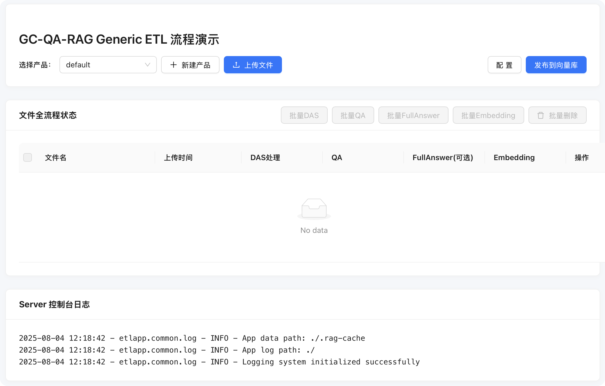

# GC-QA-RAG

GC-QA-RAG 是一款面向葡萄城产品生态（包括 活字格、WYN、SpreadJS 和 GCExcel 等）的检索增强生成（RAG）系统。是将 RAG 场景应用在生产环境中的最佳实践。

该框架完全开源，提供了 RAG 的全套解决方案，包括文档分片、文档索引、文档检索、文档生成等，开箱即用。

- github: https://github.com/GrapeCity-AI/gc-qa-rag
- wiki: https://grapecity-ai.github.io/gc-qa-rag

## 框架引导

### 分片 
GC-QA-RAG 基于文档内容的情况，提供了多种分片策略：

- 短文档的处理策略：基于句子技术的动态控制；
- 长文档的处理策略：两阶段记忆 - 聚焦对话机制。

框架提出了专属的 QA 机制，将文本的切片内容结合问答的形式，构建出更契合用户问答场景的切片结果。

[➡️ 访问详情](https://grapecity-ai.github.io/gc-qa-rag/zh/1-技术原理/1-切片方案/)

### 索引 

基于 QA 的切片结果，可通过多个维度进行 embedding，从而提供更多维度下，更精准的向量索引。

- 问题稀疏向量
- 问题稠密向量
- 答案稀疏向量
- 答案稠密向量

[➡️ 访问详情](https://grapecity-ai.github.io/gc-qa-rag/zh/1-技术原理/2-向量检索/#2)

### 召回与重排

GC-QA-RAG 在向量数据库检索时，选择使用多路混合检索，兼顾关键词和语义理解，并将检索结果采用 RRF 算法进行融合排序。支持通过类别标识进行筛选，避免语义混乱。并将最终的结果进行去重，确保知识点唯一。

[➡️ 访问详情](https://grapecity-ai.github.io/gc-qa-rag/zh/1-技术原理/2-向量检索/#2)

### 生成

GC-QA-RAG 提供了结构化的 Prompt 设计，并支持多轮对话支持，有效提升复杂场景下的问答能力。

[➡️ 访问详情](https://grapecity-ai.github.io/gc-qa-rag/zh/1-技术原理/2-向量检索/#2)
