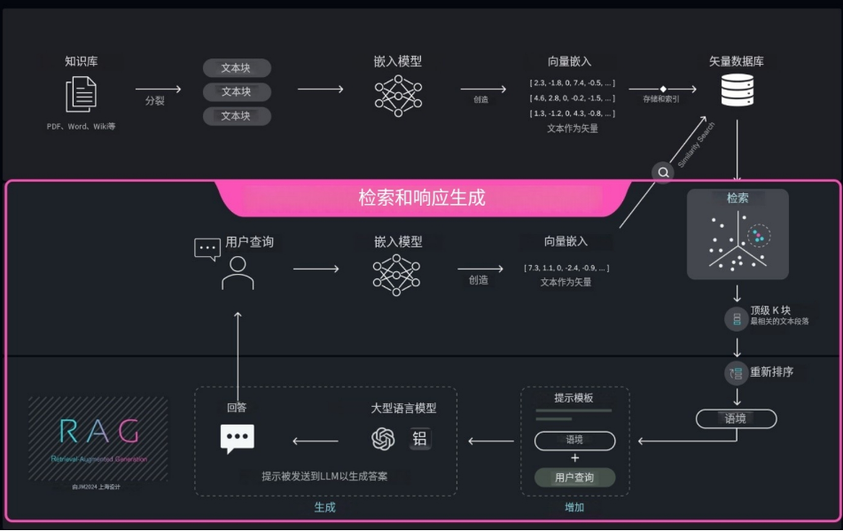

# 简介

您是否正在寻找一种可靠的方法来构建智能知识客服或强大的知识库？**检索增强生成 (RAG)** 技术正是您实现这些目标的理想选择。

RAG，全称为 Retrieval-Augmented Generation，中文译为检索增强生成。这项技术的核心在于整合两大关键功能：

- 检索：根据用户的提问，从现有的知识库中精准地找出最相关的文档或信息。
- 生成：依据检索到的文档内容，智能地生成准确、连贯的答案。

RAG 是当前最主流的 AI 问答解决方案之一，已被广泛应用于企业级知识助手和智能客服系统的搭建，帮助众多企业提升客户服务效率和知识管理水平。

## 教程目标

本教程将深入浅出地阐述 RAG 的实现原理，并详细指导您如何从零开始搭建一个完整的 RAG 系统。
通过学习本教程，您不仅能透彻理解高质量智能客服和知识库的构建逻辑，
还能进一步探索葡萄城开源的企业级 RAG 系统框架 [GC-QA-RAG](https://github.com/GrapeCity-AI/gc-qa-rag)，
从而为生产环境的部署打下坚实基础。