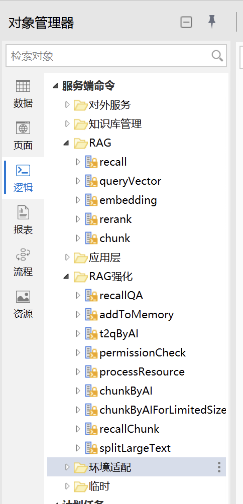
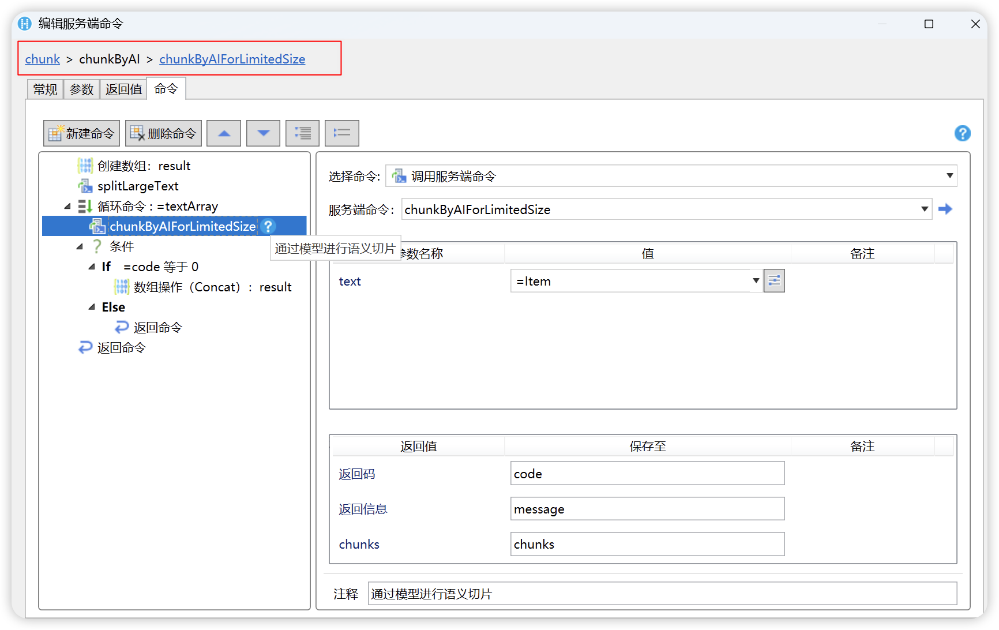
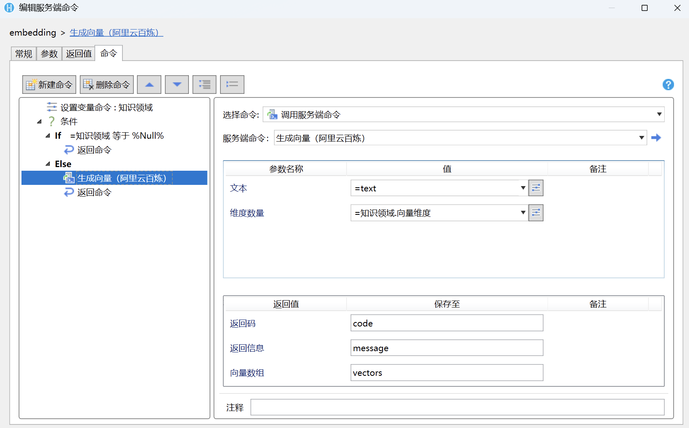
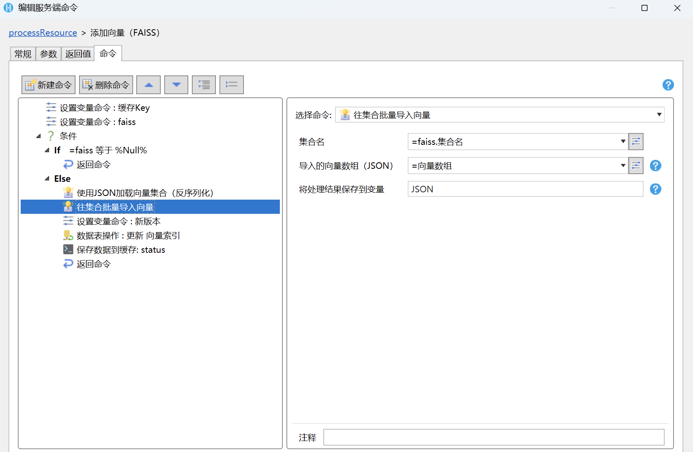
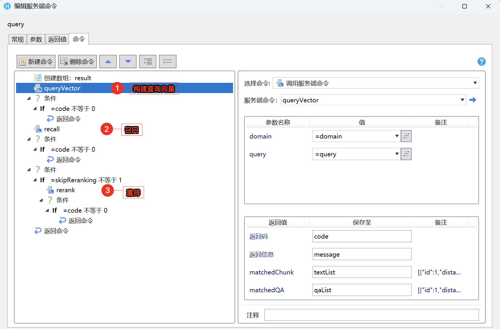
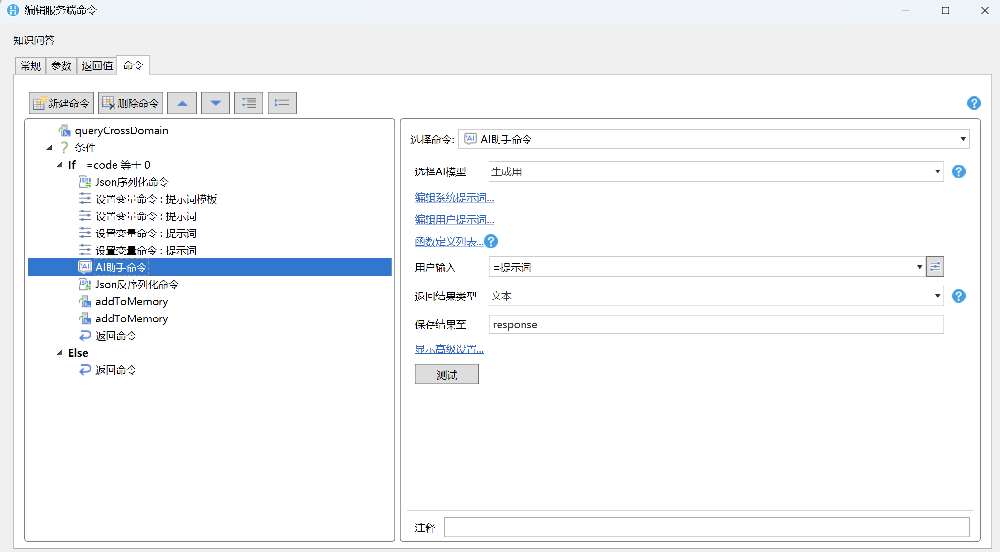

# RAG 实战 - 低代码模式

本章节将通过低代码的方式，帮助您快速构建一个 RAG 系统。教程采用的低代码平台为 `活字格`。

## 环境准备

### 设计器

我们的构建过程旨在了解 RAG 的落地实现，因此，仅需安装设计器，即可在本地测试实践。

> [!NOTE]
> 活字格设计器免费下载试用，无需获取商务授权。
> 
> 活字格设计器下载地址：[活字格设计器](https://www.grapecity.com.cn/solutions/huozige/download)

### 向量数据库

为方便低代码模式下的实践，我们选择使用一个基于内存的向量数据库 `Falss` 进行实践。您无需关心该数据的安装，葡萄城市场已经提供了 `Falss` 插件，您可以直接在设计器中进行安装。

> [!TIP]
> 您可以在 [`Falss` 插件](https://marketplace.grapecity.com.cn/ApplicationDetails?productID=SP2505120001&productDetailID=D2507240007&tabName=Tabs_detail) 中获取插件，并查看更多信息。

### 模型服务

模型服务仍选择阿里云百炼平台。考虑到实现的通用性，低代码平台的模型服务选择了通用的 REST 接口，您需要在设计器中安装 [`发送 HTTP 请求命令`](https://marketplace.grapecity.com.cn/ApplicationDetails?productID=SP2104270003&productDetailID=D2504240037&tabName=Tabs_detail)的插件。
在必要情况下，您可能需要安装插件 [`JSON 序列化/反序列化`](https://marketplace.grapecity.com.cn/ApplicationDetails?productID=SP2111150001&productDetailID=D2504240024&tabName=Tabs_detail)，
以及 [`读取HTTP请求HEAD`](https://marketplace.grapecity.com.cn/ApplicationDetails?productID=SP2203310008&productDetailID=D2211090001&tabName=Tabs_detail)。

## RAG 实现

RAG 所有的实现逻辑均维护在活字格的「逻辑 -> 服务端命令」中。

### 分片
在低代码模式下，分片的动作也交由 AI 模型来实现，这样无需过分关注文本格式，仅通过语义即可实现效果较好的切片。

### 索引

1. 向量生成。与 embedding 模型通信，加入了知识领域维度参数，方便后续只是维护时，可按照知识领域进行区分，不过其实现思路与代码完全一致。

2. 向量存储。将向量与原始文本存储到内存数据库 `Falss` 中。

### 召回与重排

低代码实现中，提供了召回与重排两个步骤的实现。其中，重排调用了阿里云百炼平台的文本排序模型 [`gte-rerank`](https://bailian.console.aliyun.com/?spm=5176.29619931.J__Z58Z6CX7MY__Ll8p1ZOR.1.74cd521cYkojVu&tab=api#/api/?type=model&url=https%3A%2F%2Fhelp.aliyun.com%2Fdocument_detail%2F2780056.html&renderType=iframe)。

### 生成

低代码实现中，生成的环节可视为应用层的一部分，因此可以将其逻辑按照知识问答模板的形式进行设计。

## 总结

至此，低代码的 RAG 实践完成。您可以在[葡萄城市场](https://marketplace.grapecity.com.cn/ApplicationDetails?productID=SP2506040002)中下载教程的工程文件。
在打开工程文件时，系统会自动安装其依赖的所有插件。

> [!TIP]
> 工程文件是面向企业内部知识库搭建的完整方案落地，RAG 仅是其中一环。如果您有相对轻量的知识库场景，可以考虑基于该工程进行实践，也可以基于此进行完整知识库的落地学习。
> 
> 关于该方案更详细的内容，请参考 [基于语义检索的知识型AI智能体（RAG范式）](https://www.grapecity.com.cn/articles/ai/ai-agent-design-and-development/technical-implementation-of-low-code-ai-agents/kb-and-rag)。
