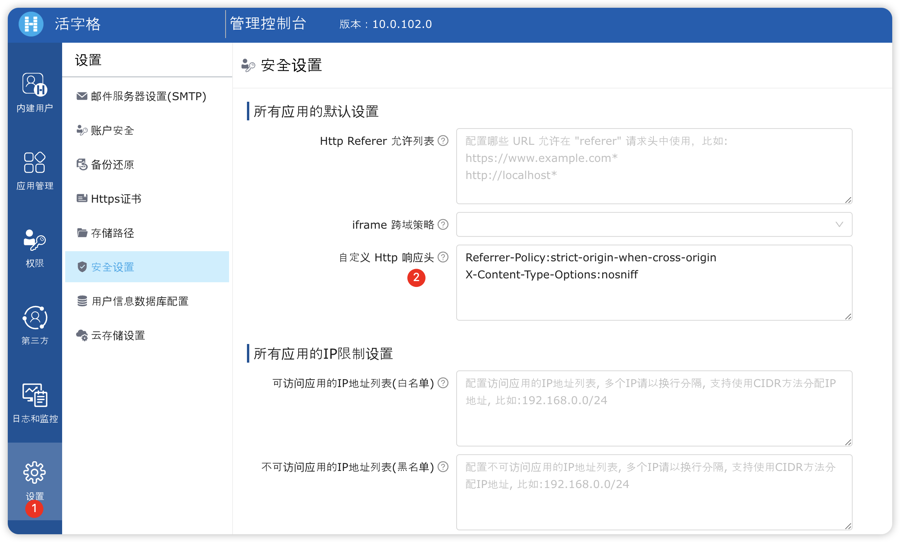

# 跨域请求

跨域请求（Cross-Origin Request）是指浏览器从一个来源（域名、协议、端口）向另一个不同来源发送的请求。

> [!NOTE]
> 例如，页面在 `https://example.com` 上运行，但尝试向 `https://api.another.com` 发出请求，这就是跨域请求。

在活字格应用的实施场景中，经常会遇到跨系统的对接与集成。这时必然会存在在已有系统的页面上请求活字格应用的服务接口，或者在已有页面中内嵌活字格应用页面并免登录跳转，这些场景都是跨域请求的典型场景。

## 跨域限制

为了保证数据的安全，浏览器本身提供了 **同源策略（Same-Origin Policy）** 的安全机制，用来防止恶意网站访问另一个网站的敏感信息。

> [!NOTE]
> 如果没有同源策略，用户可能会在不知情的情况下，通过恶意网站向另一个站点发起请求，窃取数据或者造成其他危害。

同源策略的核心限制包括：

1. **DOM 访问限制**：不同源的页面无法操作彼此的 DOM。
2. **Cookie 和存储限制**：一个源不能读取另一个源的 Cookie、LocalStorage 等。
3. **网络请求限制**：跨域的 Ajax 请求会受到限制，无法正常获取响应内容。

由于同源策略的存在。当您使用 `iframe` 跨域集成活字格页面的时候，必然会出现如下现象：

> 尽管在您的 `iframe` 中可以查看到活字格的页面，但是经过活字格的授权后，您无法正确跳转到鉴权成功后的页面上。活字格的管理控制台中的应用日志也会会报错如下信息：
>
> ```text
> Invalid request with no permission.
> ```

这是因为跨域集成触发了同源策略中 Cookie 禁止传递的限制。

## 解决方案

### 接口跨域请求

对于接口层面的跨域请求，您可以在服务器侧设置合适的 HTTP 响应头，允许特定来源的请求，也就是 CORS（跨域资源共享）。例如：

-   `Access-Control-Allow-Origin`: 指定允许的来源（可以是具体域名，也可以是 `*` 表示允许所有来源）。
-   `Access-Control-Allow-Methods`: 指定允许的 HTTP 方法（如 GET, POST, PUT）。
-   `Access-Control-Allow-Headers`: 指定允许的自定义请求头。

一个允许来自 `https://example.com` 的跨域请求示例：

```http
Access-Control-Allow-Origin: https://example.com
Access-Control-Allow-Methods: GET, POST
Access-Control-Allow-Headers: Content-Type
```

> [!TIP]
> 您可以将 CORS 配置在活字格的管理控制台中，也可以配置在活字格的前置 Nginx 上。
>
> -   活字格的管理控制台：
>     
> -   Nginx:
>
>     ```nginx
>     location / {
>        add_header Access-Control-Allow-Origin *;
>        add_header Access-Control-Allow-Methods "GET, POST, OPTIONS, PUT, DELETE";
>        add_header Access-Control-Allow-Headers "Content-Type, Authorization";
>        if ($request_method = 'OPTIONS') {
>            add_header Access-Control-Allow-Origin *;
>            add_header Access-Control-Allow-Methods "GET, POST, OPTIONS, PUT, DELETE";
>            add_header Access-Control-Allow-Headers "Content-Type, Authorization";
>            return 204;
>        }
>
>        proxy_pass http://backend;
>     }
>
>     ```

### iframe 跨域集成

此类场景在浏览器的安全策略中属于高危行为。因此要求集成与被集成侧必须使用 HTTPS。此外，您仍然需要在活字格侧开启 `samesite`，才能保证 cookie 的正常传递。

-   活字格的应用必须为 **HTTPS** 且绑定认证证书。如果应用本身是 HTTP，使用 Nginx 代理为 HTTPS，会出现不可预估的问题。
-   集成的应用本身也必须为 **HTTPS** 且绑定认证证书。
-   活字格 **应用内部的高级设置** 中请开启 `samesite`。

    > [!NOTE]
    > 活字格管理控制台的 iframe 跨域策略默认允许在任意页面的 iframe 中显示。如果您有额外的安全需求，请自行调整策略。

-   如果您的活字格应用前置了 Nginx 网关，为确保数据传递正常，请在 Nginx 上配置 samesite：
    ```nginx
    proxy_cookie_path / "/; SameSite=None; Secure";
    ```
