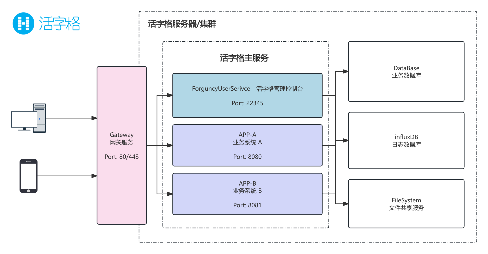

# 简介

网关（Gateway）是计算机网络中的一个重要组件，作为不同网络或系统之间的桥梁。

在软件服务和分布式系统中，网关的含义更加具体，它通常指 API Gateway，即一种用于管理和控制客户端与后端服务交互的中间层。

-   在网络层面上，网关可以是一个硬件设备或软件，用于连接不同的网络协议或拓扑结构（如企业内网和互联网）。

-   在应用层面上，网关是一种服务，充当客户端请求与后端服务之间的中介，负责流量管理、安全保护、协议转换等功能。

## 架构

在经典的系统部署架构中，活字格服务管理器（安装在服务器上的服务，加载和运行使用设计器开发的应用）定位于应用服务器。而应用服务器在面向最终用户提供服务时，稳定性、安全性、高可用等都需要重点关注。因此，在应用服务器与最终用户之间，非常建议为您的活字格服务器架设一个网关服务。



通过网关服务，您可以实现：

-   提供统一的访问入口。终端用户只需访问网关，而无需关心后端服务的具体实现。这样后端的活字格服务可以随时变更或扩展。
-   所有的请求都会通过网关服务进入系统，方便对访问的请求和流量做相应的监控和处理。
-   只需在网关侧 [配置 HTTPS](./https)，后端的所有服务便都可以对终端客户提供 HTTPS 服务了。避免了多处维护证书的繁琐。
-   通过访问不同的路径，将客户端的请求转发至不同的应用上。
-   集群场景下，可以在网关侧配置负载均衡，提升系统的性能和可靠性。
-   黑白名单的管控，可以有效放置来自外部的网络攻击。
-   更多网络场景在安全性与便利性的实践。

## Nginx

[Nginx](https://nginx.org/en/) 是一款高性能的 HTTP 服务器和反向代理服务器，广泛应用于静态资源托管、负载均衡和高并发环境中。它以事件驱动架构著称，能够高效处理大量并发请求，不仅适合作为反向代理隐藏后端服务，还能通过缓存和限流提升系统性能。由于其灵活的模块化设计，Nginx 还可以实现请求路由、访问控制和 SSL/TLS 加密等功能，是构建现代化 web 服务和分布式系统的核心组件之一。

在活字格的应用场景中，Nginx 也是您构建网关服务的首选之一。

### 安装

Nginx 提供了多平台的安装方式。

-   Linux：基于您系统的版本，建议使用相应的包管理器进行下载安装。当然，如果您有指定版本号需求，Nginx 官方提供了相应的压缩包下载。
-   Windows：Nginx 官方提供了.zip 包，在指定目录内解压即可。

安装完成后，需要将 Nginx 命令加入到环境变量中，并将服务设置为开机自启，避免每次手动启动服务。

### 使用

Nginx 的核心功能就是应对 HTTP 请求的处理。由于具体硬件、操作系统及应用场景的不同，需要 Nginx 在对 HTTP 请求的处理方法上进行不同的调整，为了应对这些差异，Nginx 提供了多种配置指令，让用户可以根据实际的软硬件及使用场景进行灵活配置。

因此，Nginx 使用的核心在于对 Nginx 配置文件的设置。根据您安装方式不同，Nginx 的配置文件目录也会有些不同。您可以进入到 Nginx 的安装目录下，寻找文件 `nginx.conf` 即可，这是 Nginx 唯一的默认配置入口。

> [!TIP]
> 建议您的 Nginx 配置遵循 Debian 的网页服务器配置文件标准:
>
> -   创建的网站配置文件放置于 Nginx 安装目录下的 `sites-available` 文件夹中，并为需要启用的网站创建一份配置文件软连接到 `sites-enabled` 文件夹。
> -   `sites-available` 与 `sites-enabled` 可自行创建。
>
> 如果您的系统是非 Debian 系列的系统，您需要将 `nginx.conf` 配置文件中的内容修改为如下所示的 Debian 风格：
>
> ```nginx
> http {
>    # ...
>    include /etc/nginx/conf.d/*.conf;
>    include /etc/nginx/sites-enabled/*;
>  }
> ```
>
> -   `include` 为 Nginx 提供的配置指令，用于引入其他配置文件的内容。
>
> 为了便于维护，建议每个网站都可以在目录 `sites-available` 中创建对应的 server 配置文件，然后将配置软链至 `sites-enabled` 中。通过 `include` 指令将 `sites-enabled` 中的所有开启的配置文件引入到入口配置文件 `nginx.conf` 中。这样只需删除软链，就可以在不删除真实配置的情况下完成网站的快速上下线。

Nginx 提供了非常丰富的指令用于管控自身的各种能力以及相关模块的能力。您感兴趣的话可以参考官网文档，也可以访问[这里](./nginx-config)以作参考。

### 可视化

如果您拥有多个 Nginx 服务器，或者希望通过可视化的方式对 Nginx 进行配置管理。您可以选择：

-   [Nginx UI](https://nginxui.com/zh_CN/)
-   [Nginx Proxy Manager](https://nginxproxymanager.com/)
